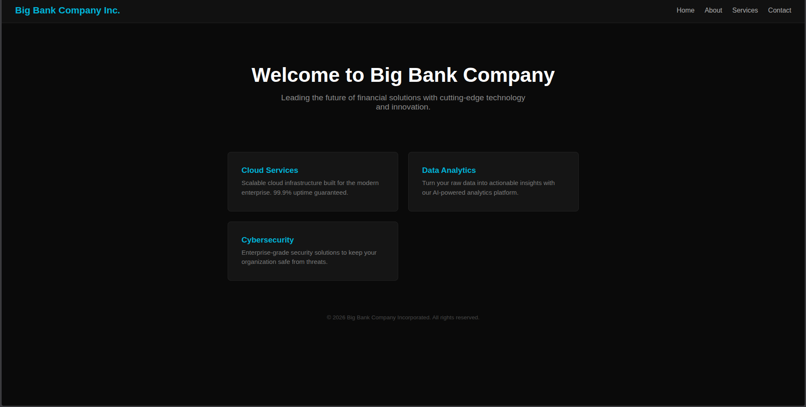
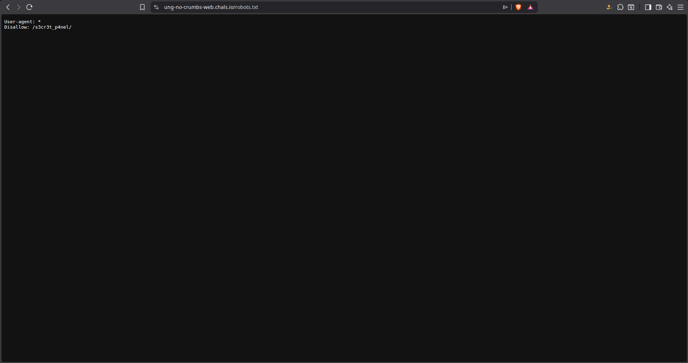
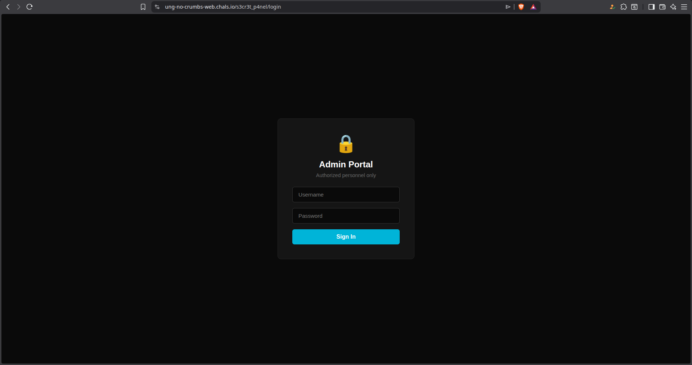
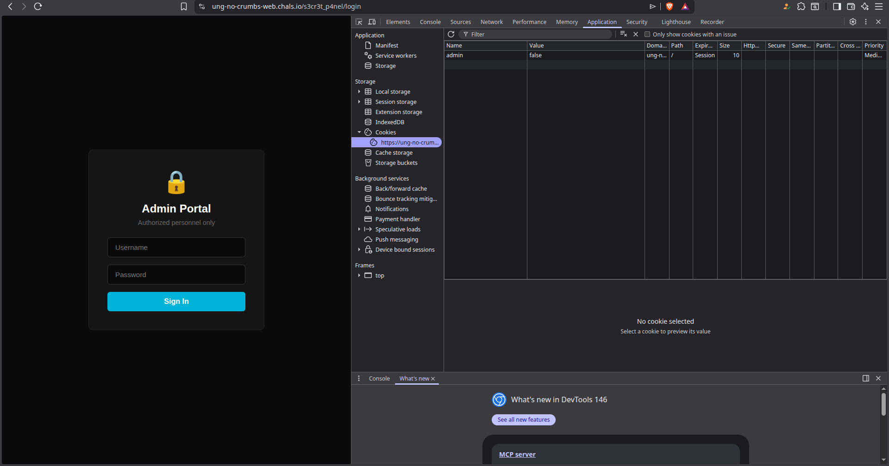
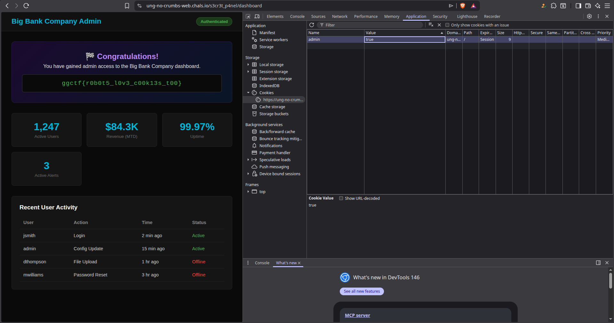

# No Crumbs - Goldrush Gauntlet 2026 Writeup

## Description 
Big Bank Company Incorporated just launched their new website. They claim their security is rock solid, but maybe they left some crumbs behind. Can you find a way in?
Target: [No Crumbs](https://ung-no-crumbs-web.chals.io/)

## Solution 

In this challenge we are tasked with somehow bypassing their authentication system. As in any web task, we start by feeling around the website. 

### Web Exploitation 

When we first load up the website we are greeted to what it looks like a normal front page

 

Lets try looking for simple paths, for example with the most common one robots.txt

 

This link didn't result in a 404, which is a good sign. What we see in `robots.txt` shows us a hidden path of `/s3cr3t_p4nel/`. Lets try this hidden path. 

 

On the screen, it looks like there is an admin portal with a username and a password that we somehow have to bypass. With the challenge name called **No Crumbs**, there might be something related to **cookies**. 
Lets Right Click --> Application --> Cookies 

We notice a cookie called `admin` that is set to `false`. In actual businesses you will notices cookies will look like a random token session, but in this case its a descriptive name like `admin=false`, it strongly implies that changing this value to `true` will result in us bypassing the login page. 

### Bypassing the Login

Lets change the admin value to true and then refresh the page, and lets see what we find: 

 

### The Flag 

Looking at the page, we are provided with the flag and have completed the challenge 

**Flag:**` ggctf{r0b0t5_l0v3_c00k13s_t00}`

## TLDR 

Go to the path `/robots.txt` and then you are met with another hidden path called `/s3cr3t_p4nel/` and then you go to the inspect, application, and then cookies, change the admin value from false to true and then reload the page to be greeted with the flag. 

## Security Impact 

1. Information Disclosure: having robots.txt as a avaiable path for the website is pretty obvious and can be a critical vulnerability 
2. Broken Access Control (OWASP A01): Having something that users can freely edit just by clicking and typing something else is a critical vulernatlity of having a client side cookie for authroization. What should be done is to have a server-side cookie for authroization using an randomized session token so its hard to guess and also hard to change. 
3. Security Through Obscurity: Having a hidden login link doesn't mean that it is always protected. Any hacker can just brute force to find the login link, or even this case type in robots.txt to find the hidden path. 
